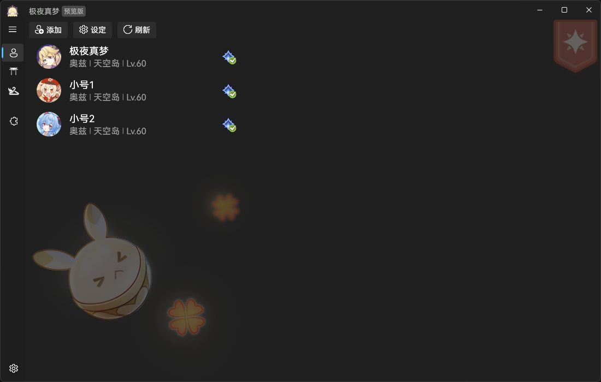
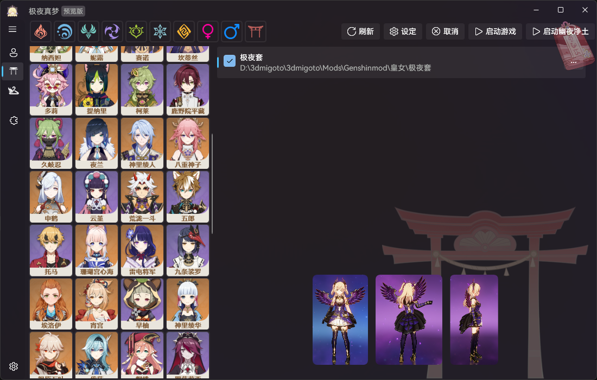
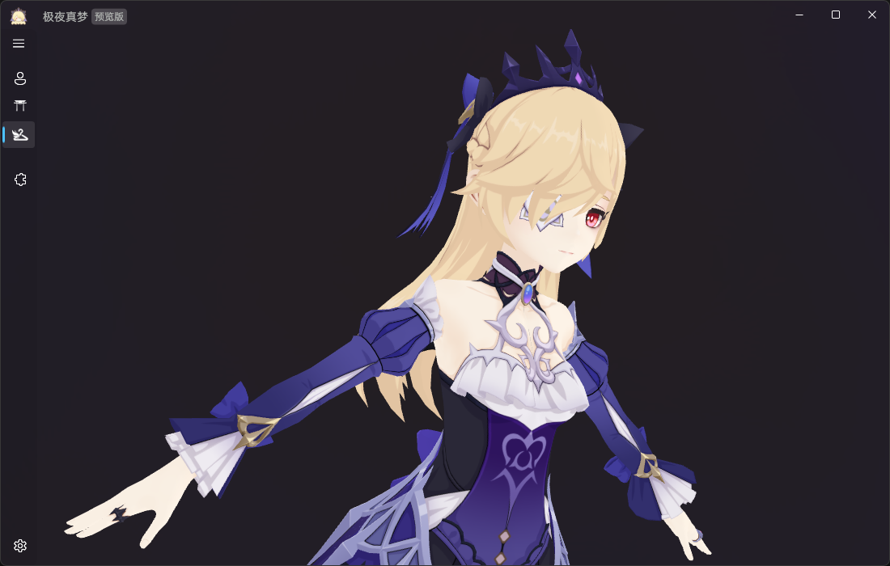
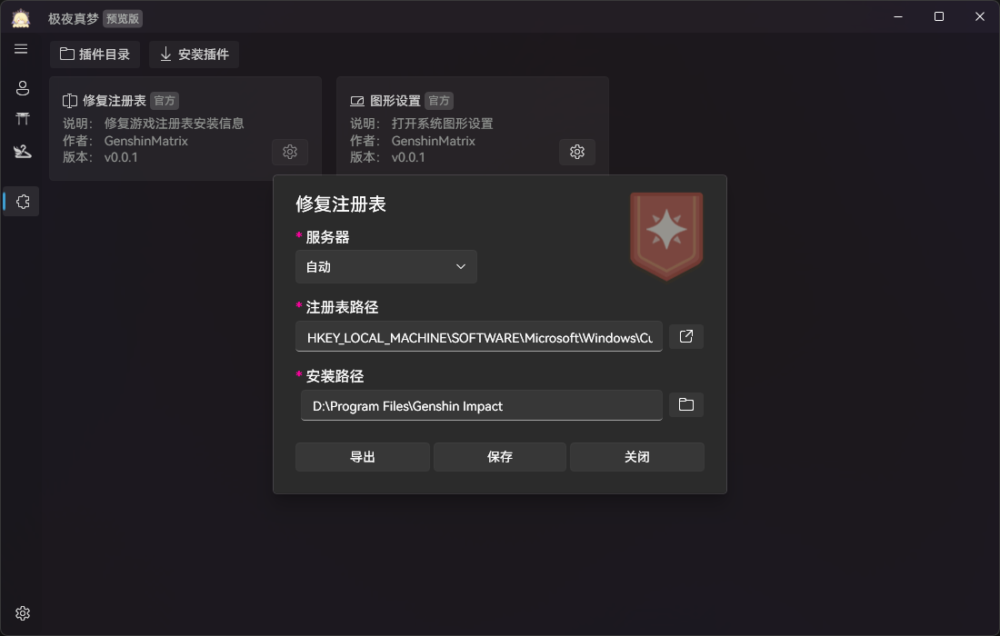

・[English](README.en.md) ・[中文](README.md) ・[日本語](README.jp.md)

# 永夜真梦

> Fischless

专注特化***幽夜净土***的原神游戏体验。

> 应用名称出自菲谢尔***Fischl***配上endless的***less***词根，表达幽夜净土永存的理念。
>
> 应用图标[出处](https://bbs.nga.cn/read.php?tid=35426436)。

## 运行环境

最低支持版本 Windows 10.0.19041.0

[.NET8运行时](https://dotnet.microsoft.com/zh-cn/download/dotnet/thank-you/runtime-8.0.0-windows-x64-installer)

[.NET8桌面运行时](https://download.visualstudio.microsoft.com/download/pr/b280d97f-25a9-4ab7-8a12-8291aa3af117/a37ed0e68f51fcd973e9f6cb4f40b1a7/windowsdesktop-runtime-8.0.0-win-x64.exe)

## 功能

- 角色账号：多账号管理，由于米游社风控仅保留基础接口（待定）；
- 幽夜净土：模型皮肤管理器，[匹配规则](src/Desktop/Fischless.Fetch/ReShade/ReShadeIniMapper.cs)；
- 模型预览：预览DMM模型，[获取模型](https://www.aplaybox.com/u/680828836)；
- 提瓦特文字：渲染游戏内文字（待开发）；
- 自动伐木：尘歌壶终结者（待开发）；
- 自动钓鱼：总会有人觉得是咱是钓鱼，姑且满足你的误会（待开发）；
- 网页标签：自定义网页标签页（待开发）；
- 插件管理：内含官方插件的同时开放自定义插件；
  - 修复注册表：修复游戏注册表安装信息；
  - 无界：无界游戏体验，游戏窗口无界也能调整窗口位置；
  - 祈愿云记录：利用代码仓库管理你的私人祈愿记录（待开发）；
  - 圣遗物预测：预测目标圣遗物的获取周期（待开发）；
  - 祈愿预测：祈愿预测概率曲线（待开发）；
  - 音轨提取：提取游戏音乐、语言轨道文件（待开发）；
  - 米游社安卓子系统：使用Win11的WSA启动国服米游社，相当于一个快捷方式；
  - 图形设置：打开系统图形设置；

- 其他：
  - 多语言：支持中日英语言（进行中）；
  - 区服：国服、国际服支持，云原神（策划中）；
  - 自动静音：原神游戏不在前台时自动静音；

## 截图

## 开发者

- 渐进式：尽可能实现渐进式库隔离；

- 格式化：[CodeMaid.config](src/CodeMaid.config)、[Settings.XamlStyler](src/Settings.XamlStyler)；

## 致谢

永夜真梦受益于以下开源项目：

- [xunkong](https://github.com/xunkong/xunkong)
- [better-genshin-impact](https://github.com/babalae/better-genshin-impact)

- [Unlocker](https://github.com/DGP-Studio/Unlocker)
